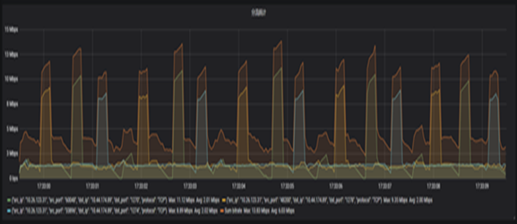
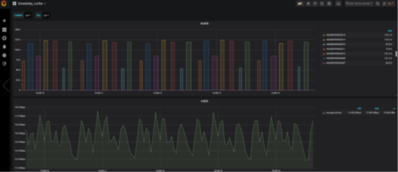
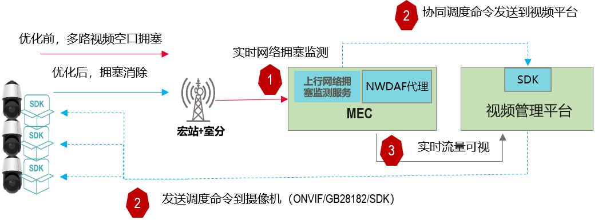
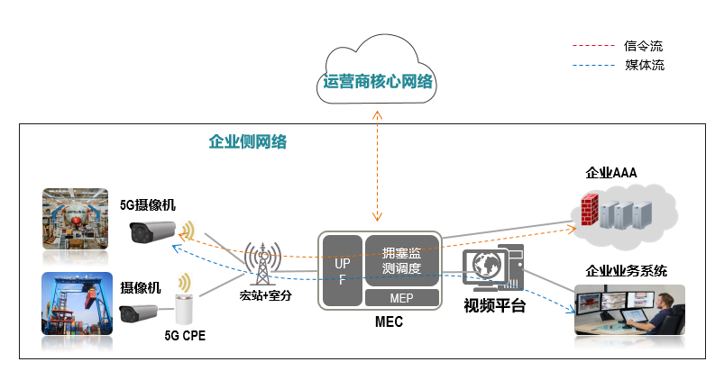

# 拥塞检测
## 功能介绍
本服务提供了实时拥塞调度，达到最佳业务体验。
* 优化视频传送带宽利用率，优化视频传送时延，减少视频卡顿或花屏。
* 视频传送SLA质量可视

网络拥塞调度前流量特征：
* 多路视频I帧发生碰撞，带宽需求增加
* 碰撞周期性发生

网络拥塞调度后流量特征：
* 视频I帧错峰发送，带宽需求小，无额外时延

典型场景传送效率优化举例（小区上行容量：210Mbps；摄像机码率：4Mbps）：
优化前，支持30路高清摄像机高品质传送，优化后，可支持44路高清摄像机高品质传送，传送效率提升46%，传送时延降低30-60ms。

## 上行拥塞检测原理简述

1. 实时监测
MEC内置网络拥塞监测服务，基于视频流量信息、空口信息、位置信息、业务策略等实时监测空口流量的拥塞状态。
2. 协同调度
监测到视频在空口发生拥塞，基于智能调度算法生成调度策略，通过和第三方视频管理平台协同，实现对视频流量的实时闭环调度。
3. 效果可视
和NWDAF协同，实现流量监测和调控效果的可视化。

## 适用场景

视频监控场景，要求每次调看多台监控。关键挑战是多路视频在无线空中拥塞，带来上行带宽和时延增加
* 多路视频拥塞带来峰值带宽增加
* 视频拥塞带来时延增加