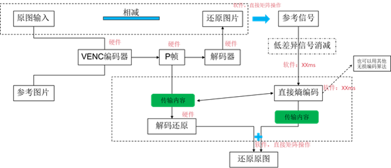
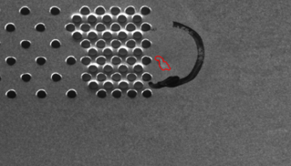
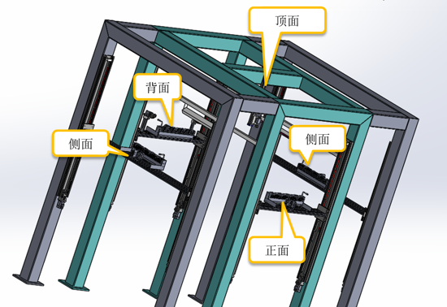
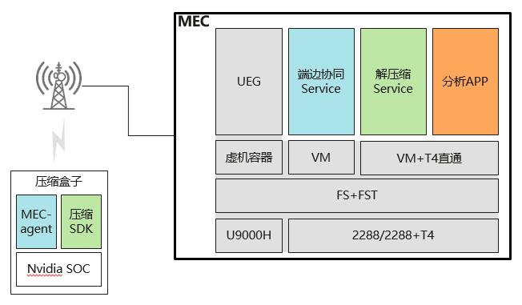
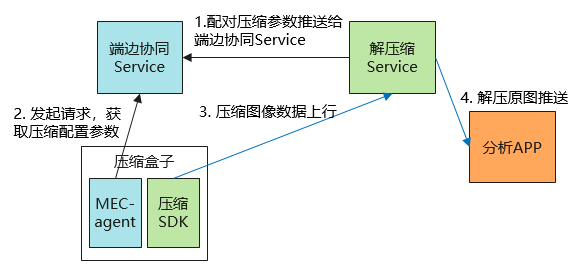

# 上行压缩
## 功能介绍

上行压缩采用无损压缩技术，图像在端侧压缩、边侧解压后，为图像分析APP提供高质量图像数据（可提供3-6倍压缩比）。

从左至右，压缩率越来越高的照片：

## 无损压缩原理简述
* 将视觉压缩（如H265）方案引入图像压缩领域，实际生产图像参考基准图像，生成P帧，取代原图传输从而减小数据传输内容。接收图像残差数据流后，进行图像恢复。
* 采用无损压缩技术，图像在端侧压缩、边侧解压后，与原图逐个像素点对比，图像灰度值有差异点不超过5个点，降低上行带宽基础上，为图像分析提供高质量图像数据（可提供3-6倍压缩比）。

## 适用场景
1. 工业视觉场景，如钣金、家电外观检测，检测外观掉漆和划伤。需要将外观进行拍照留存，然后传给分析APP分析。
   

2. 部署方案如下，图像数据经端侧压缩盒子压缩后上行到边侧。

3. 业务流程如下，压缩盒子将压缩参数和压缩图像数据上行，解压缩Service将解压后的图片数据推送给分析APP进行分析。

4. 受上行带宽的限制，采用有损压缩，图片经还原后无法满足精度要求时，建议采用本服务。

## 开放能力

### 开放压缩配置API
通过APIGW对3rd APP开放API

### 无损压缩参数快速调校
将图像分析对图像质量要求快速转换为无损压缩参数